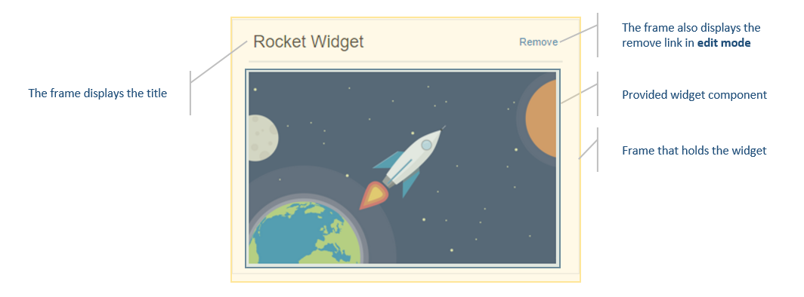

## Implementing a custom Widget Frame component
A widget frame is an element which surrounds a widget. Widget frame contains the title of the widget and the remove widget button.



Dazzle comes with a default frame built it. By default this frame will be used when displaying widgets in the dashboard. If you don't like the style of this frame or you need to implement some additional functionality into the frame, you could build your own fancy frame and ask Dazzle to use your frame instead of the default.

### Show me the code

> Below example uses [React's state-less components](https://facebook.github.io/react/docs/reusable-components.html#stateless-functions).

```javascript
const CustomFrame = ({title, editable, children, onRemove }) => {
  return (
      <div className="custom-frame-container">
        <div className="custom-frame-title">
            <h2>{title}</h2>
            {editable &&<a onClick={() => {onRemove();}} >Remove</a>}
        </div>
        <div className="custom-frame-content">
          {children}
        </div>
    </div>
  );
};
```

A custom frame is just another React component. Custom frame will be provided with 4 properties you can make use of as follows.

| Props | Type |Description |
| --- | --- |
|title | string |Title that should be displayed in the frame.|
|editable | Boolean |Denotes weather the dashboard is in editable mode or not. You can use this |
|children | React element |Children of the frame. The widget that is going to be rendered. |
|onRemove | Function |The function that should be called when you want to remove the widget. |

### How to let dazzle know about this?
Well it's extremely simple.

```javascript
import Dashboard from 'react-dazzle';
import CustomFrame from './CustomFrame';

<Dashboard /* Other props goes here*/ frame={CustomFrame}  />
```

Now all the widgets will use your fancy frame.

#### More docs
- [Readme](../README.md)
- [Add a widget](./AddWidget.md)
- [Implementing custom Frame component](./ImplementingACustomFrame.md)
- [Implementing custom AddWidget component](./ImplementingCustomAddWidgetButton.md)
