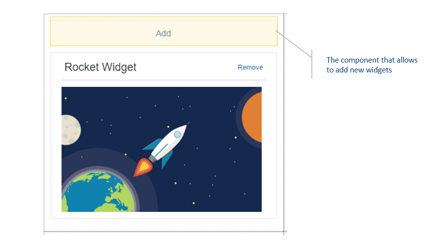

## Implementing a custom `AddWidget` component
Add widget component is the one which appears on top of columns when dashboard is in edit mode. When you click on it, it will allow you to add new widgets. Dazzle by default comes with a default `AddWidget` component. If you wish you could customize this component as you prefer.



### Show me the code

```javascript
const CustomAddWidgetButton = ({text, onClick}) => {
  return (
    <div>
      <button onClick={onClick}>{text}</button>
    </div>
  );
};
```

A custom `Add Widget` Component is just another React component. This component will be provided with 2 props you can make use of as follows.

| Props | Type |  Description |
| --- | --- |
| text | string | Text that should be displayed. This text is provided through the `addWidgetComponentText` prop of dashboard.|
| onClick | Function | The function should be called when user wants to add a widget. |

### How to let dazzle know about this?
```javascript
import Dashboard from 'react-dazzle';
import CustomAddWidget from './CustomAddWidget';

<Dashboard /* Other props goes here*/ addWidgetComponent={CustomAddWidget}  />
```

#### More docs
- [Readme](../README.md)
- [Add a widget](./AddWidget.md)
- [Implementing custom Frame component](./ImplementingACustomFrame.md)
- [Implementing custom AddWidget component](./ImplementingCustomAddWidgetButton.md)
